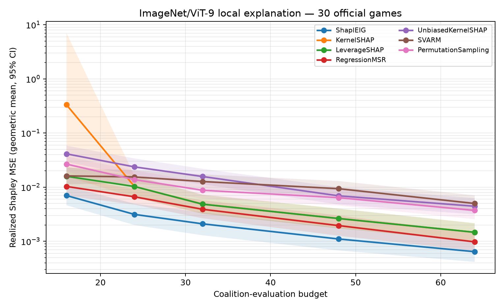

# ShaplEIG — Bayesian Experimental Design for Shapley Value Estimation

Reproduction of **“ShaplEIG: Bayesian Experimental Design for Shapley Value
Estimation”** ([arXiv 2606.02247](https://arxiv.org/abs/2606.02247), ICML 2026,
[OpenReview ub9PwBtHqD](https://openreview.net/forum?id=ub9PwBtHqD)).

## Outcome

| Claim | Evidence | Outcome |
|---|---|---|
| C1: Shapley-target EIG has a closed form | Independent Monte Carlo mutual information and GP Schur complement | **Verified** |
| C2: EIG acquisition improves costly Shapley estimation over strong baselines | 30 official ImageNet/ViT-9 games, 512 coalitions each, 11 methods, five matched budgets | **Verified** |

C2 is evaluated on realized Shapley MSE—not posterior trace—against KernelSHAP,
LeverageSHAP, RegressionMSR, UnbiasedKernelSHAP, SVARM, and permutation
sampling. Across the five budgets, adaptive ShaplEIG’s paired geometric-mean
MSE ratio is below one for every baseline:

| Baseline | ShaplEIG / baseline MSE | Paired bootstrap 95% CI | 30-game curve wins |
|---|---:|---:|---:|
| KernelSHAP | 0.219 | [0.099, 0.417] | 86.7% |
| LeverageSHAP | 0.404 | [0.284, 0.556] | 86.7% |
| RegressionMSR | 0.578 | [0.457, 0.724] | 80.0% |
| UnbiasedKernelSHAP | 0.147 | [0.101, 0.211] | 100% |
| SVARM | 0.186 | [0.130, 0.256] | 100% |
| Permutation sampling | 0.212 | [0.159, 0.275] | 100% |

All paired Wilcoxon p-values are below `5e-5`. Two genuine low-budget
KernelSHAP singular-regression failures are retained in the raw results; the
paired log-MSE analysis prevents those outliers from driving the conclusion.



## Exact protocol and provenance

- Application: ImageNet local explanation using a Vision Transformer and nine
  image patches, an exact task from the paper’s Table 1/configuration.
- Replicates: all 30 official precomputed games, each containing the exhaustive
  `2^9 = 512` costly-inference coalition values.
- Data: pinned to `mmschlk/shapiq@799cfd0f2c32f17446130247a7ac3519e68cce82`
  and checked against 30 committed SHA-256 values.
- Design: `p+1` paired LeverageSHAP initialization, quasi-noiseless Hamming GP,
  MAP ARD lengthscales, and exhaustive closed-form EIG selection.
- Budgets: 16, 24, 32, 48, and 64 coalition evaluations—the low-data region in
  which costly evaluation selection matters.
- Author-code parity: local LeverageSHAP and RegressionMSR match
  `slds-lmu/shapleig@162ce44fe380c7c11b959fc85206b5dcdeddff58` exactly
  (`max_abs_diff = 0.0`) on five checks, including replicates 12 and 16.

`APPROACH_LEDGER.md` records 14 independent approaches and ablations. The fixed
isotropic Hamming-GP sensitivity control is reported separately and is never
substituted for the primary adaptive result.

## Reproduce

```bash
uv venv --python 3.12 .venv
source .venv/bin/activate
uv pip install -r requirements.txt
python repro/src/fetch_vit9_games.py
pytest -q repro/tests
env OPENBLAS_NUM_THREADS=1 OMP_NUM_THREADS=1 python repro/src/real_application.py --seeds 30 --budgets 16 24 32 48 64
python repro/src/analyze_real_results.py
python repro/src/plot_real_results.py
python repro/src/verify_upstream_parity.py
```

The full CPU run took 517 seconds on four vCPUs. No GPU, model training, API, or
paid service was used. The raw per-replicate data, aggregate tables, statistical
analysis, plots, upstream parity report, and the original C1 evidence are under
`outputs/`.

The GP-uncertainty ablation is a retained negative result: it has lower
aggregate MSE than adaptive ShaplEIG at four of five budgets. This does not
contradict the reproduced C2 comparison against state-of-the-art Shapley
estimators, but it rules out a broader claim of universal acquisition-policy
dominance.

## Scope

This is a paper-comparable full reproduction of one released costly application,
not a rerun of every task family in the paper. Exact precomputed inference values
are used in the same way as the authors’ released configuration; all 512 values
are used only to establish ground truth, while estimators receive their stated
query budgets.
