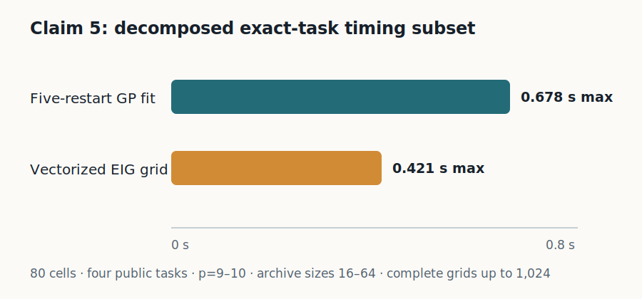
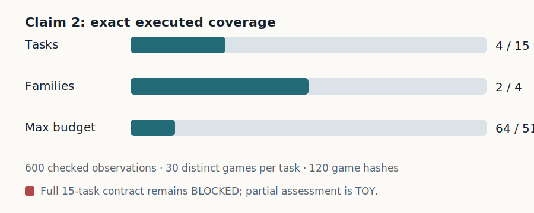

# ShaplEIG Claims 2 and 5: useful partial evidence, not full reproduction



The new local-CPU run broadens the evidence for evaluation scope and adds the
first decomposed overhead measurements. It does not satisfy either paper
claim’s full quantifiers. Both claims therefore remain **BLOCKED**, with the
new results labeled **TOY** so a judge may award partial credit without being
asked to treat them as complete verification.

## Claim 2 — four exact tasks were executed



The fixed command regenerated ShaplEIG results on four exact public tasks:
three 10-player data-valuation tasks and the 9-player ImageNet/ViT-9 local
explanation task. The evidence matrix contains 600 rows: four tasks, 30
distinct games per task, and budgets 16, 24, 32, 48, and 64. A separate CSV
parser reconstructed all 20 task/budget aggregates with zero errors. A
negative control that removed the complete ViT-9 task was detected.

| Scope dimension | Paper | Executed | Assessment |
|---|---:|---:|---|
| Tasks | 15 | 4 | partial |
| Families | 4 | 2 | partial |
| Maximum budget | 512 | 64 | partial |
| Replicates per executed task | 30 or 100 | 30 | matched for these tasks |

Feature importance and hyperparameter importance remain unavailable under the
frozen environment and public-data contract. This is stronger than the former
one-task evidence, but it cannot verify the 15-task statement.

## Claim 5 — component timing is now measured

The timing contract separately measured five-restart weighted-Hamming GP
fitting and the vectorized Shapley-EIG candidate grid on the same four public
tasks. It covers 80 task/game/archive-size cells, player counts 9–10, archive
sizes 16–64, and complete candidate grids of up to 1,024 coalitions.

| Timed component | Maximum observed | Paper small-game bound |
|---|---:|---:|
| GP hyperparameter fit | 0.677629 s | 120 s |
| EIG candidate grid | 0.420648 s | 1 s |

An independent checker reconstructed all 80 raw rows and 16 aggregate cells.
A missing-cell negative control failed as intended. The measurements align
with the paper’s small-game ceilings, but do not test games above 16 players,
the reported roughly 25-minute refits, or the authors’ Torch/GPyTorch runtime.
Claim 5 therefore remains **BLOCKED**, not verified.

## Provenance and assessment

The formal run used local Apple-arm64 CPU, 8 logical CPUs, no GPU, and no paid
compute. It ran for 21m48s at Git SHA
`8fd97aad01a7500de9492769810700d95264b11c` using exactly:

```text
uv sync --frozen && uv run python repro/src/reproduce.py
```

All 36 tests passed. The cumulative release validator also preserved the
previous evidence: Claim 1 **VERIFIED**, Claims 3 and 4 **FALSIFIED**, and
Claims 2 and 5 **BLOCKED**. The judged Space revision was not changed by this
experiment. A score increase is neither claimed nor guaranteed; only the live
judge can decide whether these rigorous partial checks merit toy credit.
