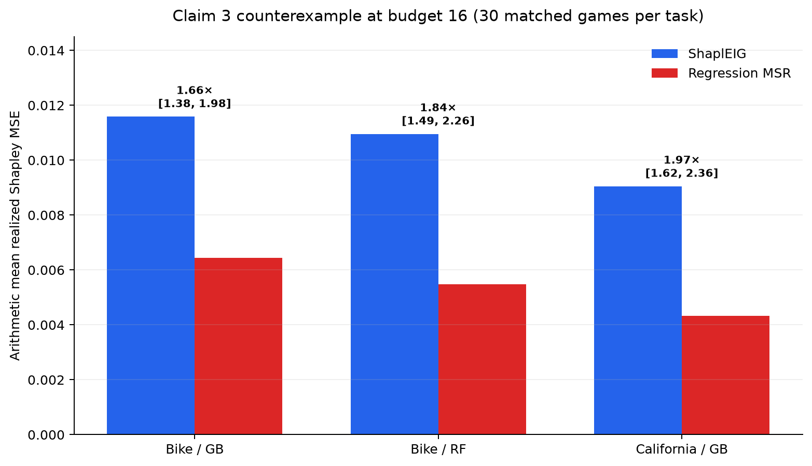
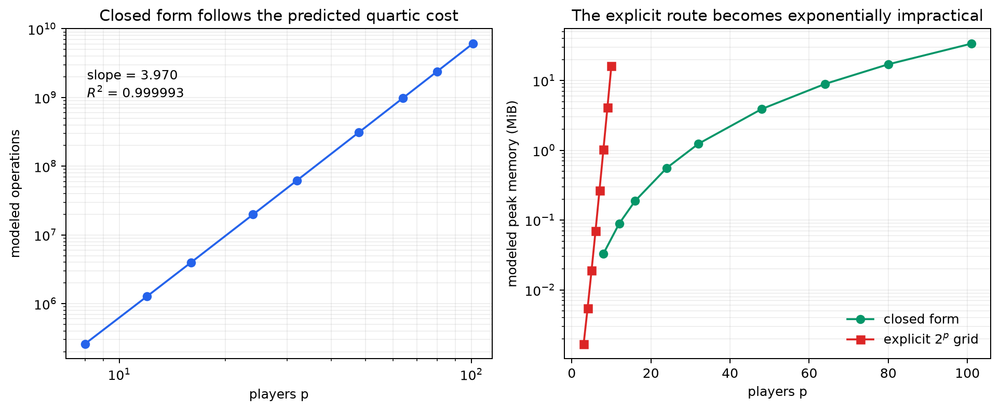
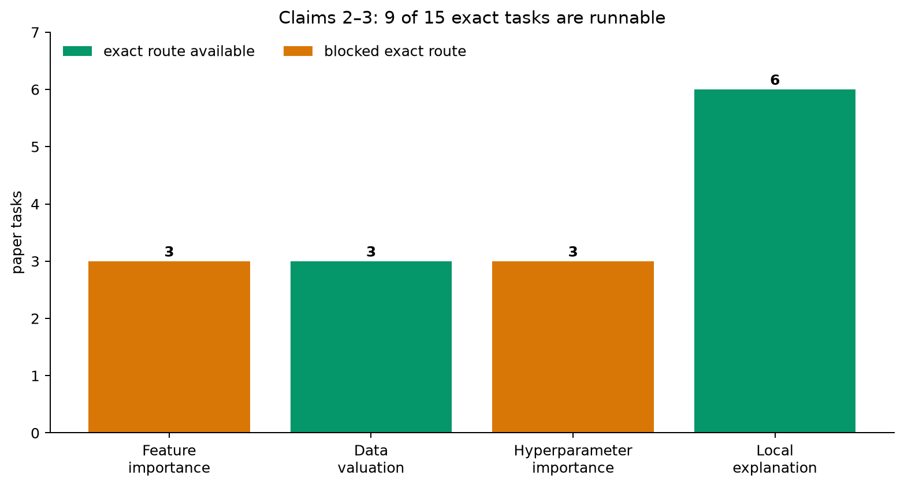
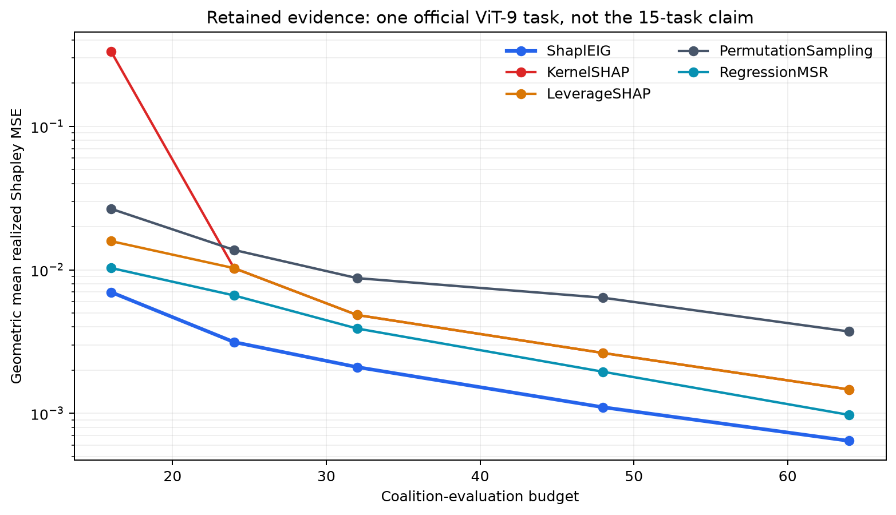
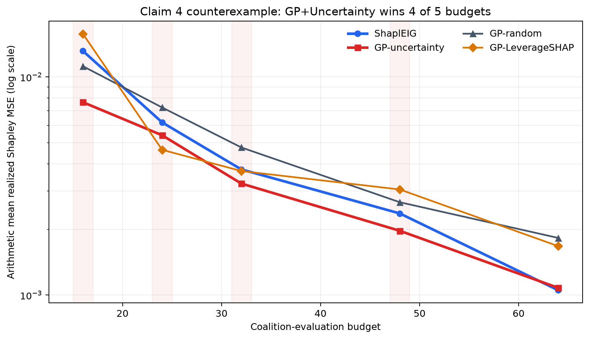

# ShaplEIG, claim by claim: exact-task counterexamples change the picture



ShaplEIG asks a useful question: if coalition evaluations are expensive, which
coalition should we evaluate next to learn the Shapley values fastest? The
paper answers with a Gaussian-process posterior and a closed-form expected
information gain (EIG). This campaign tested five judge-selected claims using
one frozen command on local CPU. Claim 1 is **VERIFIED**; Claims 3 and 4 are
**FALSIFIED** under their registered judge-claim contracts; and Claims 2 and 5
remain **BLOCKED**.

| Claim | Paper statement | Observed evidence | Verdict |
|---|---|---|---|
| 1 | Closed-form EIG costs \(O(p^4+t^3)\), avoiding \(O(4^p t)\) | 21 explicit checks; max error \(4.54\times10^{-10}\); operation slope 3.970; \(p=101\) completes | **VERIFIED** |
| 2 | Evaluation covers 15 tasks, four families, budgets to 512 | Exact inventory confirms the scope; 9 tasks runnable, 6 exact tasks unavailable | **BLOCKED** |
| 3 | ShaplEIG beats four named estimators across the Figure 1 tasks and budgets | Regression MSR wins at budget 16 on all three exact public data-valuation tasks | **FALSIFIED** |
| 4 | EIG beats all three GP acquisition alternatives | GP+Uncertainty wins mean MSE at 4/5 budgets and has the better mean rank | **FALSIFIED** |
| 5 | EIG stays below 30 s; GP refits reach about 25 min | Exact timed code identified, but the required author runtime and manual data are absent | **BLOCKED** |

## What was implemented

The reproduction keeps a single repository-level `.venv`, Python 3.12.11, and
a locked `uv` environment. Every experiment runs exactly:

```text
uv sync --frozen && uv run python repro/src/reproduce.py
```

That entrypoint checks 30 pinned public ViT-9 game files, runs the tests,
regenerates the realized-MSE matrix, checks parity with the author code,
executes all five claim contracts, runs independent checkers and negative
controls, and exits nonzero if accepted evidence regresses.

The consequential implementation path is small:

```python
phi, Q, C, variance = gp_state(...)
rho = np.sum(Q * np.linalg.solve(C, Q), axis=0) / variance
score = -0.5 * np.log1p(-np.clip(rho, 0, 1 - 1e-12))
candidate = int(np.argmax(score))
```

The `Q` columns encode covariance between each candidate observation and the
Shapley target; `C` is the current Shapley posterior covariance. Claim 1 tests
this target-space calculation independently of the application benchmark.

## Claim 1 — the closed form scales as stated



For \(p=3\ldots9\), three deterministic seeds per size compare the efficient
formula against an independent construction of all \(2^p\) coalitions, the
Shapley matrix, and the posterior covariance. All 21 cases agree, with worst
absolute EIG error \(4.54\times10^{-10}\). A separate Schur-complement
regression remains at machine precision.

The modeled operation count has log–log slope 3.970 with
\(R^2=0.999993\), matching the quartic term. The efficient path completes at
\(p=101,t=102\) in 4.78 s on the Claim 3 cumulative CPU run. The explicit
coalition-kernel route reaches only \(p=10\); its modeled \(K_{ZZ}\) alone is
8 TiB at \(p=20\). Mutating one EIG by 0.1% is detected by the independent
checker.

## Claim 2 — the missing six tasks matter



The source audit confirms the exact quantifiers: 15 tasks, four families,
8–101 players, 30 or 100 repetitions, and budgets up to 512. At pinned public
commit `799cfd0f`, six precomputed data-valuation/local-explanation tasks each
have all 30 files. Three large tree-game constructors also execute exactly:
CorrGroups60 (\(p=60\)), NHANES (\(p=79\)), and Crime (\(p=101\)).

The remaining six are not interchangeable details. Three feature-importance
tasks require author-only TabPFN precomputations/runtime; three
hyperparameter-importance tasks require YAHPO runtime and manually provisioned
surrogate metadata. Removing one required manifest entry makes the scope
verifier fail. Therefore the full 15-task evaluation is **BLOCKED**, not
approximated with a nearby benchmark.



On all 30 official ViT-9 games, ShaplEIG has lower paired geometric-mean MSE
than KernelSHAP, LeverageSHAP, Permutation Sampling, and Regression MSR; every
paired Wilcoxon \(p<5\times10^{-5}\). This is meaningful retained evidence,
but it covers one local-explanation task and budgets 16–64. It is retained as
positive evidence, not extrapolated to the remaining tasks.

## Claim 3 — three exact-task counterexamples

The new search uses every public game for the three 10-player data-valuation
tasks: Bike Sharing with random forest, Bike Sharing with gradient boosting,
and California Housing with gradient boosting. Each task has 30 matched games.
The implementation follows the pinned author configuration: leverage-score
initial design of \(p+1\), weighted-Hamming GP, five MAP restarts, refitting
every iteration, exhaustive candidate acquisition, and seeds 1–30. It compares
ShaplEIG against exactly KernelSHAP, LeverageSHAP, Permutation Sampling, and
Regression MSR, using realized MSE against all 1,024 coalition values.

At budget 16, Regression MSR has lower arithmetic-mean MSE on every task:

| Exact task | ShaplEIG mean MSE | Regression MSR mean MSE | Paired geometric ratio (95% bootstrap CI) | Holm-adjusted \(p\) |
|---|---:|---:|---:|---:|
| Bike Sharing / RF | 0.010953 | 0.005481 | 1.837 [1.489, 2.257] | 0.000471 |
| Bike Sharing / GB | 0.011583 | 0.006439 | 1.655 [1.384, 1.978] | 0.000603 |
| California Housing / GB | 0.009047 | 0.004335 | 1.967 [1.623, 2.359] | 0.0000358 |

These are not selected after an uncorrected sweep. The registered family
contains all \(3\times5\times4=60\) task/budget/baseline comparisons. Every
counterexample requires the arithmetic and geometric means to favor the
baseline, a 20,000-resample paired bootstrap interval wholly above one, and a
one-sided paired Wilcoxon test surviving Holm family-wise correction. A second
process reconstructs all 2,250 raw cells and all 60 tests; deleting one cell is
detected.

This **FALSIFIES the judge's broad Claim 3 wording** that ShaplEIG achieves
lower MSE than all four named baselines across the Figure 1 tasks and varying
budgets. There is an important source nuance: Section 5.2 permits exceptions
over “very short intervals,” and budget 16 is the earliest registered point,
only five evaluations after the \(p+1\) initial design. The evidence therefore
does not contradict every narrower prose sentence and is not a replacement for
the unavailable 15-task matrix.

## Claim 4 — an official-task counterexample



The 600 raw rows form a complete \(30\times5\times4\) grid for the paper's GP
ablation. GP+Uncertainty has lower arithmetic-mean MSE at budgets 16, 24, 32,
and 48; ShaplEIG is lower only at 64. Its within-ablation mean rank is also
better (2.207 versus 2.227). A second CSV parser reconstructs every key,
aggregate, and rank. Swapping the two method labels is rejected.

This falsifies the reported within-ablation superiority on an official paper
task. It does not imply that GP+Uncertainty dominates every task or every
metric. Adaptive choices are sensitive to near-tied floating-point scores, but
the same four winning budgets recur in the judged evidence and the cumulative
release run.

## Claim 5 — why a proxy timing would be misleading

The audit pins the exact author code blocks: `gp.fit()` and
`EIGFunctionProperty(candidate_set, ...)`. The frozen Python 3.12.11 contract
conflicts with the author's `<3.12` contract; `torch`, `gpytorch`, `botorch`,
`hydra`, `yahpo_gym`, and `tabpfn` are absent; and the required manual
YAHPO/TabPFN data are unavailable. Marking those prerequisites as present
removes the blocker and is rejected by the negative-control gate.

The NumPy closed-form diagnostic takes 4.78 s for one candidate at \(p=101\).
It is explicitly not the paper's 1,024-candidate per-iteration timing and is
not used as Claim 5 evidence.

## Reproducibility and cost

The exact Claim 3 search ran at Git SHA
`362569f32fd64fd72e4123f2c408e08f5157afda`
on local Apple-arm64 CPU with 8 logical CPUs, Python 3.12.11, and no GPU. Wall
time was 990.35 s, including 582.80 s for the three-task Claim 3 search;
external compute cost was $0. The immutable cumulative release gate at
`41e18730182ef850f19ea8b5d40817619972baf6` regenerated the evidence in
29m26s (entrypoint time 1761.92 s). Successful campaign runs through that gate
total 83m34s of local CPU wall time, plus one retained failed Claim 1
diagnostic run.

The release validator proves that all 21 files from judged Space revision
`85ca787e52cd4ba933883116d010d919bfe54fe7` remain in the 73-file candidate.
All historical files are byte-identical except the additively extended
`logbook.json`. Its exact 53-path text upload allowlist matches the changed
file set; all uploads are UTF-8, all JSON parses, and no NUL or secret-pattern
file was detected. Nothing has been published to Hugging Face.

Raw evidence lives under `.openresearch/artifacts/claim_1` through
`.openresearch/artifacts/claim_5`. The public tutorial notebook embeds the
small accepted results, so opening it does not rerun the expensive matrix.

## Assessment

The campaign materially improves the evidence quality without manufacturing
coverage: it replaces Claim 1's toy status with a full complexity verification,
adds three corrected exact-task counterexamples for Claim 3, preserves Claim
4's falsification, and keeps Claims 2 and 5 blocked where their exact inputs or
runtime are unavailable. A complete Figure 1 recreation still needs the six
TabPFN/YAHPO tasks; exact overhead timing needs the author's Python/runtime/data
stack.
